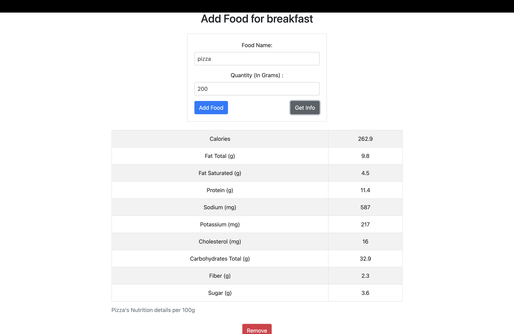
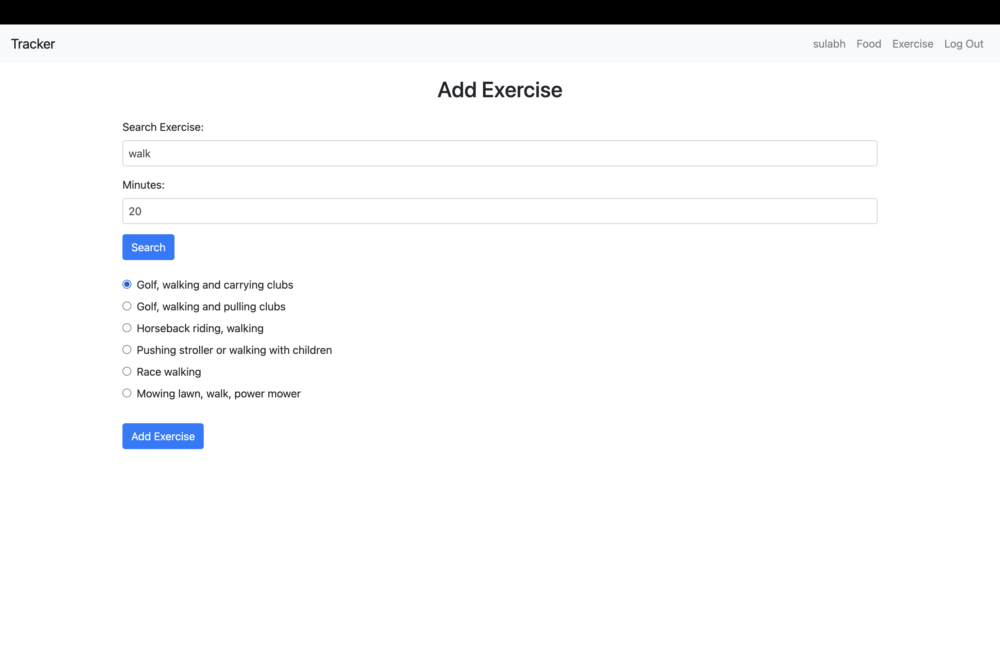

# Fitness Tracker
https://web-production-2f98.up.railway.app/
---

## Overview

The Fitness Tracker website is designed to help users manage their fitness goals effectively. It provides features for tracking daily calories, reviewing food intake, searching for nutritional information, and tracking exercise calories burned.

## Technologies Used

The Fitness Tracker website was developed using the following technologies:

- Front-end: 
  - 
  - 
  - 

- Back-end: 
  - 
  - 

- Database: 
  - 

- Deployment: 
  - 

## Screenshots from the app






## Features

- User Registration: Users can register by providing their name, sex, date of birth (DOB), height, current weight, goal weight, and daily activity level.
- Daily Summary: After registration, users are presented with a daily summary, including remaining calories to consume for the day.
- Food Tracking: Users can review all the foods they have consumed for the day, along with their protein, carbs, cholesterol, and sugar contents.
- Nutritional Information: Users can search for nutritional information about various foods to make informed dietary choices.
- Exercise Tracking: Users can track their exercise and monitor the calories burned.


## Installation

To run the Fitness Tracker website locally, follow these steps:

1. Clone the repository:

   ```
      git clone https://github.com/sulabhkatila/fitness-tracker.git
      cd fitness-tracker
   ```

2. Install the required dependencies:
   ```
      pip install -r requirements.txt
   ```

3. Set up environment variables:
   Create a .env file in the project root directory and provide the following variables:
   ```
      SECRET_KEY=your_secret_key
      API_KEY=your_api_key
      DEBUG=True
   ```

4. Run database migrations:
   ```
      python manage.py migrate
   ```

5. Start the development server:
   ```
      python manage.py runserver
   ```

6. Access the website at http://localhost:8000.

## Contributing
Contributions to the Fitness Tracker website are welcome! If you find any issues or have suggestions for improvement, please open an issue or submit a pull request to the repository.

## License
This project is licensed under the MIT License.